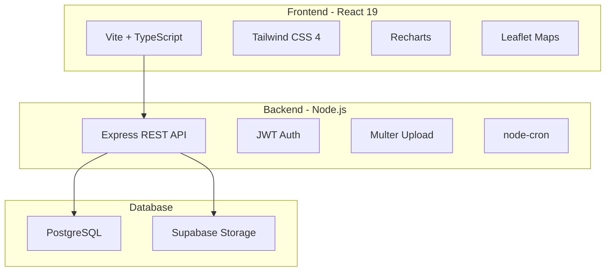
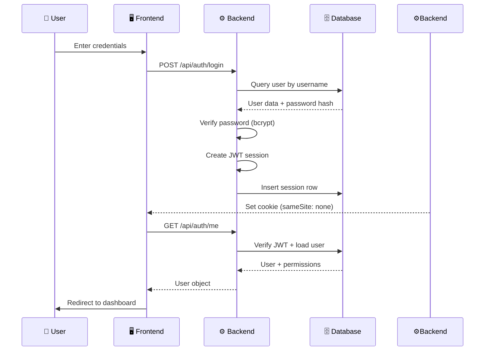
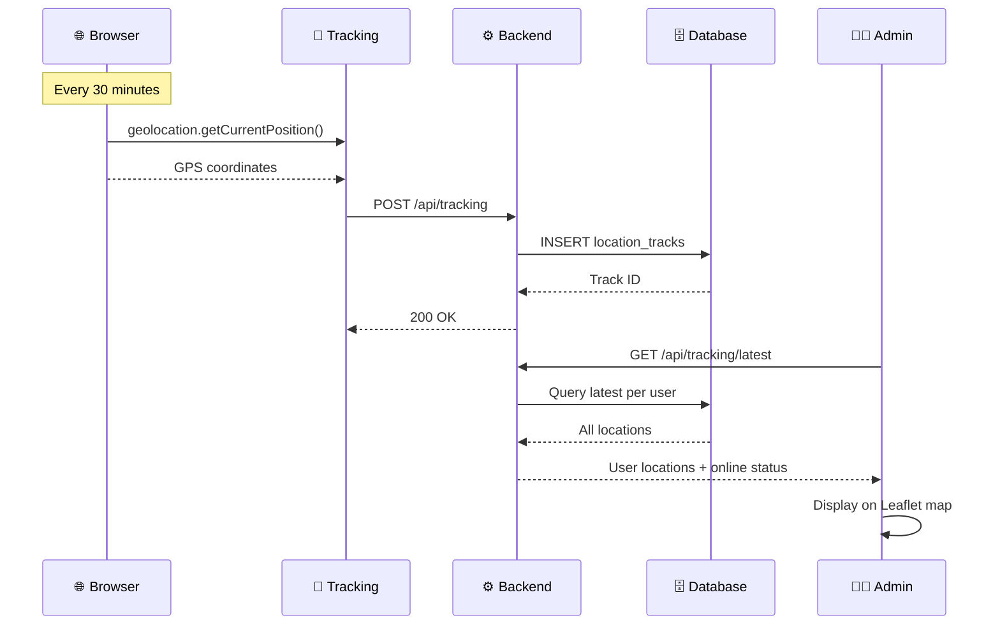
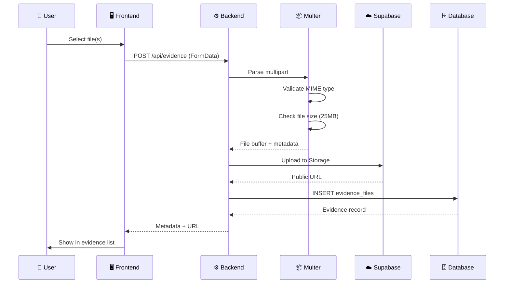
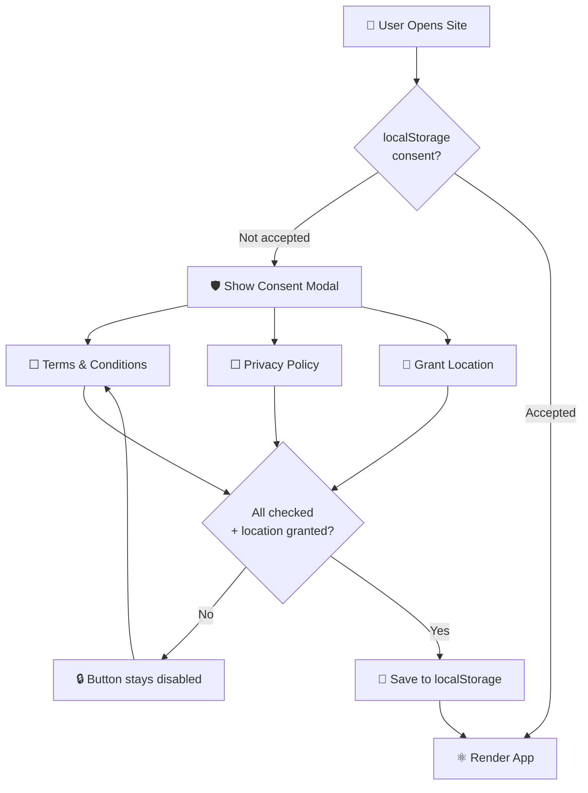
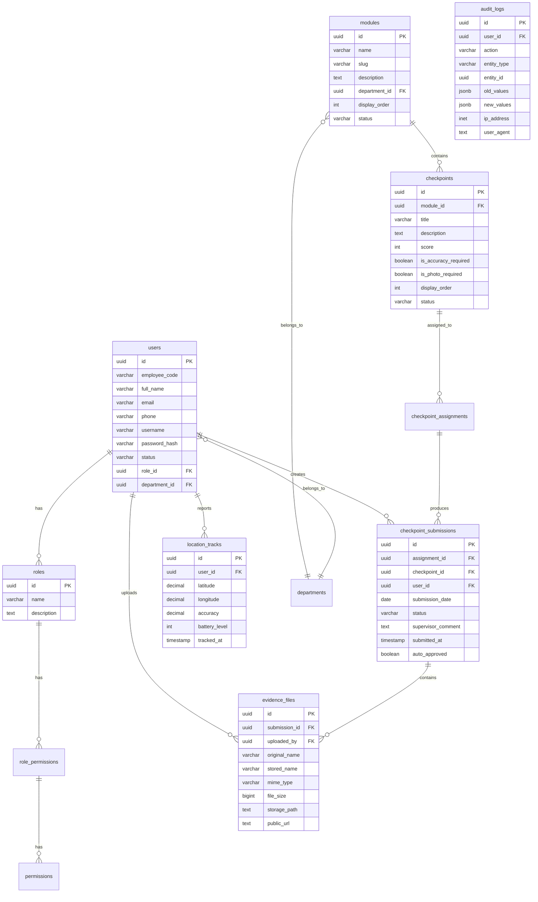

<div align="center">


#  BSC Exclusive Tracking

### Enterprise Process & Compliance Tracking Platform


<br/>


<br/>


---


</div>

---

##  Live Demo

<div align="center">

| 🌐 Frontend | 🔧 Backend API |
|:---:|:---:|
| [](https://bsc-v1-seven.vercel.app) | [](https://bsc-v1.onrender.com) |
| `https://bsc-v1-seven.vercel.app` | `https://bsc-v1.onrender.com` |

</div>

---

##  Highlights

<div align="center">

|  |  |  |
|:---:|:---:|:---:|
| **6 Roles** | **Live GPS** | **Evidence Upload** |
| RBAC with 40+ permissions | 30-min auto sync | Images, PDF, CSV, Audio |

|  |  |  |
|:---:|:---:|:---:|
| **Auto-Approval** | **Notifications** | **Reports & Export** |
| 1-hour window | Real-time in-app | CSV analytics |

</div>

---

##  Tech Stack

<div align="center">



</div>

|  Layer | Technology | Purpose |
|:---|:---|:---|
|  | React 19 + Vite + TypeScript | SPA with code splitting |
|  | Tailwind CSS 4 | Utility-first styling |
|  | Recharts | Dashboard analytics |
|  | Leaflet | Live GPS tracking map |
|  | Node.js + Express | REST API server |
|  | JWT + bcrypt | Secure sessions |
|  | Multer + Supabase | File handling |
|  | PostgreSQL (Supabase) | Relational storage |

---

##  Architecture

<div align="center">

```
┌─────────────────────────────────────────────────────────────────────┐
│                        👤 USER'S BROWSER                            │
│                                                                     │
│  ┌───────────────────────────────────────────────────────────────┐  │
│  │                    ⚛️  REACT 19 (Vite)                        │  │
│  │                                                               │  │
│  │  ┌──────────┐  ┌──────────┐  ┌──────────┐  ┌──────────┐    │  │
│  │  │ 🛡️ Consent│  │ 🔐 Auth  │  │ 📍 Track │  │ 📄 Pages │    │  │
│  │  │   Gate   │→ │ Provider │→ │ Provider │→ │ (Routes) │    │  │
│  │  └──────────┘  └──────────┘  └──────────┘  └──────────┘    │  │
│  │                                                               │  │
│  │  ┌──────────────────────────────────────────────────────┐    │  │
│  │  │         🌐 API Client (fetch + credentials)           │    │  │
│  │  └──────────────────────────────────────────────────────┘    │  │
│  └───────────────────────────────────────────────────────────────┘  │
│                              │                                      │
│                    HTTPS /api/* requests                             │
│                              │                                      │
└──────────────────────────────┼──────────────────────────────────────┘
                               │
                    ┌──────────▼──────────┐
                    │   ▲ VERCEL          │
                    │   Static + CDN      │
                    │   + API Proxy       │
                    └──────────┬──────────┘
                               │
                    ┌──────────▼──────────┐
                    │   ⚙️ RENDER         │
                    │   Node.js/Express   │
                    │   REST API          │
                    └──┬──────┬──────┬───┘
                       │      │      │
          ┌────────────▼┐  ┌──▼───┐  ▼──────────────┐
          │  🗄️ SUPABASE │  │ 🔑  │  📦 SUPABASE    │
          │  PostgreSQL  │  │ JWT │  Storage         │
          │  (Database)  │  │(🔒) │  (Files)         │
          └──────────────┘  └─────┘  └──────────────┘
```

</div>

---

##  Project Structure

<div align="center">

```
bsc_v1/
├── 🎨 frontend/                    # React SPA
│   ├── src/
│   │   ├── 🧩 components/          # Reusable UI components
│   │   │   ├── 🛡️ ConsentGate.tsx  # Mandatory consent modal
│   │   │   ├── 📱 AppShell.tsx     # Layout wrapper
│   │   │   ├── 📤 EvidenceUploader  # File upload
│   │   │   └── 🎭 States.tsx       # Loading/Error states
│   │   ├── 📚 lib/
│   │   │   ├── 🌐 api.ts           # HTTP client
│   │   │   ├── 🔐 auth.tsx         # Auth context
│   │   │   ├── 📍 tracking.tsx     # GPS tracking
│   │   │   └── 🎨 format.ts        # Formatters
│   │   └── 📄 pages/               # 20+ page components
│   ├── 📦 vercel.json              # Vercel config
│   └── 📋 package.json
│
├── ⚙️ backend/                     # Express API
│   ├── src/
│   │   ├── 🚀 server.ts            # Entry point
│   │   ├── 📡 app.ts               # Express app
│   │   ├── ⚙️ config.ts            # Environment
│   │   ├── 🗄️ db.ts                # PostgreSQL pool
│   │   ├── 🔐 middleware/           # Auth + RBAC
│   │   ├── 📡 routes/              # 14 route modules
│   │   ├── ⏰ jobs/                # Background tasks
│   │   └── 🛠️ utils/               # Helpers
│   ├── 📋 package.json
│   └── 📄 tsconfig.json
│
├── 🗄️ database/                    # SQL schema
│   ├── 📄 schema.sql               # Full schema
│   └── 🌱 seeds/                   # Demo data
│
├── 🚀 render.yaml                  # Render blueprint
└── 📄 README.md                    # This file
```

</div>

---

##  Features

<div align="center">

### 🔐 Authentication & Security

</div>

| Feature | Description | Badge |
|:--------|:------------|:------|
| JWT Sessions | HTTP-only cookies, 7-day expiry |  |
| bcrypt Passwords | Salted + hashed, never stored plaintext |  |
| RBAC | 40+ granular permissions per role |  |
| Audit Trail | Every action logged with IP + user agent |  |
| CORS | Configurable allowed origins |  |

<div align="center">

### 📍 GPS Tracking

</div>

| Feature | Description | Badge |
|:--------|:------------|:------|
| Auto Sync | Every 30 minutes automatically |  |
| Live Map | Leaflet map with all team members |  |
| Online Status | Real-time online/offline detection |  |
| Location History | Full GPS trail per user |  |
| Accuracy + Battery | Device info with each ping |  |

<div align="center">

### 📤 Evidence Upload

</div>

| Type | Formats | Max Size | Badge |
|:-----|:--------|:---------|:------|
| 🖼️ Images | JPG, PNG, WEBP, GIF | 25 MB |  |
| 📄 Documents | PDF | 25 MB |  |
| 📊 Spreadsheets | CSV | 25 MB |  |
| 🎵 Audio | MP3, WAV, M4A, OGG, AAC | 25 MB |  |

<div align="center">

### ✅ Compliance Workflow

</div>

```
┌─────────┐    ┌─────────┐    ┌─────────┐    ┌─────────┐    ┌─────────┐
│ 📝 DRAFT │───>│ 📤 SUBMIT│───>│ 🔍 REVIEW│───>│ ✅ APPROVE│   │ ❌ REJECT│
└─────────┘    └─────────┘    └─────────┘    └─────────┘    └─────────┘
     │                                             │               │
     │              ⏰ Auto-approve (1hr)          │               │
     └─────────────────────────────────────────────┘               │
                                                                   │
     ┌─────────────────────────────────────────────────────────────┘
     │
     └───> 📝 Resubmit
```

---

##  Roles & Access

<div align="center">

|  |  |  |
|:---:|:---:|:---:|
| **ADMIN** | **MANAGER** | **SUPERVISOR** |
|  |  |  |
| All permissions | Approve/reject | Team management |
| Bypass all checks | View reports | Approve/reject |

|  |  |  |
|:---:|:---:|:---:|
| **AUDITOR** | **USER** | **VIEWER** |
|  |  |  |
| View submissions | Submit checkpoints | View own data |
| View audit logs | Upload evidence | View own reports |

</div>

---

##  Flow Diagrams

### 🔐 Authentication Flow



### 📍 GPS Tracking Flow



### 📤 Evidence Upload Flow



### 🛡️ Consent Gate Flow



---

##  Quick Start

<div align="center">

### 📋 Prerequisites


</div>

```bash
# 1️⃣ Clone the repository
git clone https://github.com/GaganCB2002/bsc_v1.git
cd bsc_v1

# 2️⃣ Database setup
cd database
npm install
npm run init          # Creates DB + schema + seeds
cd ..

# 3️⃣ Backend (port 4000)
cd backend
cp .env.example .env  # Edit DATABASE_URL
npm install
npm run dev           # Hot-reload

# 4️⃣ Frontend (port 5173)
cd frontend
npm install
npm run dev           # Vite dev server
```

<div align="center">

**Open** 

</div>

### 🔑 Demo Accounts

<div align="center">

| Role |  Username |  Password |  Dashboard |
|:------|:------|:------|:------|
|  | `admin` | `Admin@123456` | `/admin` |
|  | `jane.smith` | `Supervisor@123` | `/supervisor` |
|  | `mike.ross` | `Manager@123` | `/supervisor` |
|  | `john.doe` | `User@123456` | `/dashboard` |

</div>

---

##  Environment Variables

<div align="center">

### ⚙️ Backend (`backend/.env`)

</div>

| Variable | Required | Default | Description | Badge |
|:---------|:--------:|:-------:|:------------|:------|
| `PORT` | No | `4000` | Server port |  |
| `DATABASE_URL` | **Yes** | — | PostgreSQL connection string |  |
| `DB_SSL` | No | auto | Force SSL |  |
| `SESSION_SECRET` | **Yes** | — | JWT signing secret |  |
| `CORS_ORIGIN` | **Yes** | — | Frontend URLs |  |
| `FILE_STORAGE_TYPE` | No | `local` | `local` or `supabase` |  |
| `SUPABASE_URL` | If supabase | — | Supabase URL |  |
| `SUPABASE_SERVICE_ROLE_KEY` | If supabase | — | Service role key |  |
| `SUPABASE_BUCKET` | No | `evidence` | Storage bucket |  |
| `MAX_FILE_SIZE_MB` | No | `25` | Max upload size |  |
| `AUTO_APPROVE_HOURS` | No | `1` | Auto-approval window |  |

<div align="center">

### 🎨 Frontend (`frontend/.env`)

</div>

| Variable | Required | Description | Badge |
|:---------|:--------:|:------------|:------|
| `VITE_API_URL` | If separate | Backend URL |  |

---

##  Deployment

<div align="center">

### 🚀 Step-by-Step Guide

</div>

### 1️⃣ Supabase (Database)

```bash
# Create project at supabase.com
# SQL Editor → Run schema.sql
# SQL Editor → Run supabase-storage-setup.sql
# Copy Connection string + Service role key
```

### 2️⃣ Render (Backend)

```bash
# Create Web Service
# Root: backend
# Build: npm install && npm run build
# Start: node dist/server.js
# Set env vars (see table above)
```

### 3️⃣ Vercel (Frontend)

```bash
# Connect GitHub repo
# Framework: Vite
# Build: npm run build
# Output: dist
# Set VITE_API_URL=https://bsc-v1.onrender.com
# Deploy
```

---

##  API Reference

<div align="center">

### 🔐 Authentication

</div>

| Method | Endpoint | Auth | Description |
|:------:|:---------|:----:|:------------|
|  | `/api/auth/login` | No | Login |
|  | `/api/auth/me` | Yes | Get user |
|  | `/api/auth/logout` | Yes | Logout |

<div align="center">

### 👨‍💼 Admin - Users

</div>

| Method | Endpoint | Permission | Description |
|:------:|:---------|:-----------|:------------|
|  | `/api/admin/users` | `users:list` | List users |
|  | `/api/admin/users` | `users:create` | Create user |
|  | `/api/admin/users/:id` | `users:update` | Update user |
|  | `/api/admin/users/:id` | `users:delete` | Delete user |

<div align="center">

### 📦 Admin - Modules

</div>

| Method | Endpoint | Permission | Description |
|:------:|:---------|:-----------|:------------|
|  | `/api/admin/modules` | `modules:list` | List modules |
|  | `/api/admin/modules` | `modules:create` | Create module |
|  | `/api/admin/modules/:id` | `modules:update` | Update module |
|  | `/api/admin/modules/:id` | `modules:delete` | Delete module |
|  | `/api/admin/modules/:id/clone` | `modules:create` | Clone module |

<div align="center">

### 📍 Tracking

</div>

| Method | Endpoint | Permission | Description |
|:------:|:---------|:-----------|:------------|
|  | `/api/tracking` | `tracking:update` | Submit location |
|  | `/api/tracking/me` | Auth only | Own history |
|  | `/api/tracking/latest` | `tracking:view_all` | All latest |
|  | `/api/tracking/history` | `tracking:view_all` | User history |

<div align="center">

### 📤 Evidence

</div>

| Method | Endpoint | Permission | Description |
|:------:|:---------|:-----------|:------------|
|  | `/api/evidence` | `evidence:upload` | Upload file |
|  | `/api/evidence/:id` | Auth + owner | Download |
|  | `/api/evidence/:id` | Auth + owner | Delete |

---

##  Database Schema

<div align="center">



</div>

---

##  Security

<div align="center">

| Layer | Implementation | Badge |
|:------|:---------------|:------|
| 🔐 Authentication | JWT tokens in HTTP-only cookies |  |
| 🔑 Passwords | bcrypt with salt rounds = 10 |  |
| 🌐 CORS | Configurable allowed origins |  |
| 👥 RBAC | 40+ permissions per request |  |
| ✅ Validation | Zod schemas on all endpoints |  |
| 📤 Uploads | MIME allowlist + 25MB limit |  |
| 📋 Audit | Every mutation logged |  |
| 🔒 Encryption | TLS 1.3 + AES-256 |  |

</div>

---

##  Troubleshooting

<div align="center">

| Issue | Solution | Badge |
|:------|:---------|:------|
| `405` on login | Set `VITE_API_URL` in Vercel + check `vercel.json` proxy |  |
| `Cannot reach database` | Verify `DATABASE_URL` is PostgreSQL string (not HTTP) |  |
| Evidence upload fails | Check `FILE_STORAGE_TYPE=supabase` + credentials |  |
| GPS not working | Grant browser location permission |  |
| Login loop | Check `CORS_ORIGIN` + `sameSite: none` cookie |  |

</div>

---

<div align="center">


### Made with ❤️ by the BSC Exclusive Team

<br/>


<br/>


</div>
